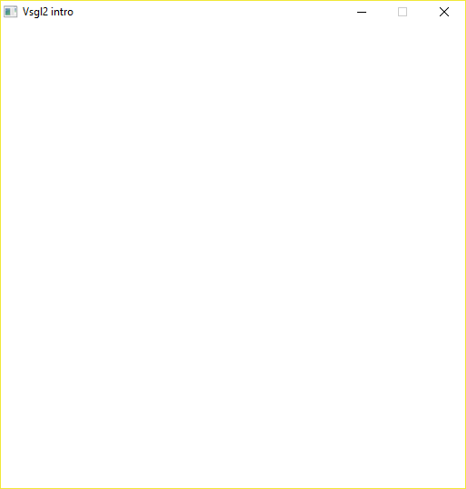

# Window creation
The very first thing to do to create a graphical program is to initialize the graphic using the `init()` function. It takes care to manage various low-level settings about video, audio and image management. It also takes care of printing library version information as it can see in this picture:


These information are visible only in the Debug build, the Release build doesn't show any window to print the output.

As a second step the `set_window()` function has to be called, in order to open a windows with the desidered dimensions.
The `set_window` function has these parameters

```c
set_window ( int width,
            int height,
            string title,
            [bool fullscreen]);
```

The fourth parameter is optional, if it is not present the application will be windowed, otherwise if it has a `true` or `1` value the application will go fullscreen.

In this example the window looks as in the following picture:



Usually, after these two function, there will be the program itself, but in this code nothing is done, so the only thing is to take the window open, using the `wait_for_button_pressed()` function. This function stop the program waiting for the pression of any button to be pressed. When the user will press any button, the program will call the `close()` function, to clean up all the resources used and to guarantee the correct termination of the program.
