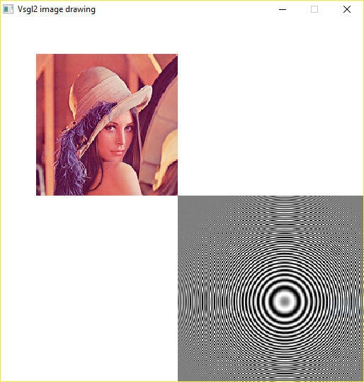

# Drawing images
Other than draw simple geometrical shapes, it is possible to draw images. An image is loaded from a file, either BMP or PNG or JPG, and put on screen simply calling this function:
```c
draw_image ( String image,
            int x,
            int y,
            int w,
            int h);
```

The first parameter is the file name. It can be expressed either using an absolute path or a relative path, as it can see in this example.
The second and the third parameter are the position of the image in terms of its left upper corner.
The last two parameters are the width and the height of the image: these dimensions are not necessarly the original dimensions of the image, but they can have any value, the library will resize the image to fit the choosen ones.

The result of this code will be the following:



The first call to ```draw_image``` loads the Lena picture in (50,50) position and 200x200 dimension, where the second call loads the moire image with a little part outside the window.
If an image or a part of it is outside the window it is not a problem: in this case only the visible part will be rendered on the screen, the remaining part will be ignored. As a conseguence, if an image is completely outside the screen, it will be invisible.

It is interesting to note that the second image has some curious effects due to the resizing operation. The original image has not such effects, called [Moiré pattern](https://en.wikipedia.org/wiki/Moir%C3%A9_pattern), but this image is choosen to stress this kind of artifacts: when an image is resized can appear different sorts of artifacts, so it is a good idea to resize the image using an image manipulation program such as [Gimp](https://www.gimp.org/) to obtain the desidered result.

## Which is the right place to put the images?
Using a relative path, which is a good idea in most situations, one solution is to store the image in the program folder, i.e. where the executable is, or, to be more structured, inside an "images" directory.

As an example, with the latter solution the path would become "images/my_image.png".


## What does it happen if the image doesn't exist or it is not in the correct place?

Nothing. Rather than crashing the application, the library manages this situation emitting a message to the console and the application will keep running without problems.
